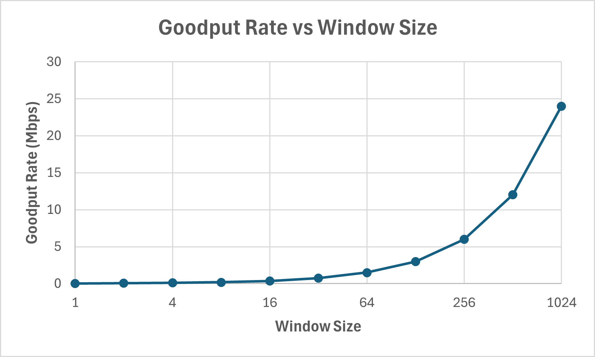
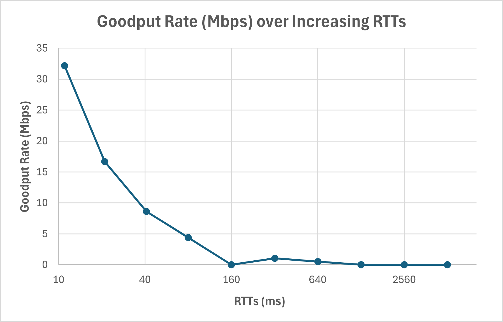

# Report: Homework 3 - Reliable Data Transfer

Cole McAnelly  
CS 463

> I have parallelized the worker thread, and my code should be able to hit the extra credit benchmark

1. **[Question 1](#question-1)**
2. **[Question 2](#question-2)**
3. **[Question 3](#question-3)**
   - [1 Gbps](#1-gbps)
   - [10 Gbps](#10-gbps)
4. **[Question 4](#question-4)**
   - [Reverse Loss Trace](#reverse-loss)
   - [No Loss Trace](#no-loss)
5. **[Question 5](#question-5)**
   - [Receiver Algorithm Used](#algorithm)
   - [Slow Start Upper Bound](#upper-bound)

<!-- ####################################################################################################### -->
## Question 1
Set packet loss $p$ to zero in both directions, the $RTT$ to 0.5 seconds, and bottleneck link 
speed to $S = 1 Gbps$. Examine how your goodput scales with window size $W$. This should 
be done by plotting the steady-state rate $r(W)$ for $W = 1, 2, 4, 8, …, 2^{10}$ and keeping the $x$ axis on a log-scale. Your peak rate will be around $24 Mbps$ and, depending on your home bandwidth, usage of an on-campus server might be necessary. Using curve-fitting, gener
ate a model for $r(W)$. Discuss whether it matches the theory discussed in class.  



- This matches the principles we learned in class. Due to there being no packed loss, and the RTT being a little higher than average, we can expect that the goodput will scale with the window sizes exponential growth.


<!-- ####################################################################################################### -->
## Question 2
Expanding on the previous question, fix the window size at $W = 30$ packets and vary the 
$RTT = 10, 20, 40, …, 5120 ms$. Plot stable rate $r(RTT)$, again placing the x-axis on a log
scale. Perform curve-fitting to determine a model that describes this relationship. Due to 
queuing/transmission delays emulated by the server and various OS kernel overhead, the 
actual $RTT$ may deviate from the requested $RTT$. Thus, use the measured average in 
your plots and comment on whether the resulting curve matches theory.




- This is exactly what we expect to see in a situation like this in theory. When the estimated delay increases, the amount of packets that are able to move through the socket are significantly reduced (throughput goes down). Numerous outside parameters could cause the measured $RTT$ to increase.


<!-- ####################################################################################################### -->
## Question 3
Run the dummy receiver on your localhost and produce a trace using $W = 8K$ (the other 
parameters do not matter as the dummy receiver ignores them, although they should still 
be within valid ranges). Discuss your CPU configuration and whether you managed to 
exceed $1 Gbps$. How about $10 Gbps$ using 9 KB packets (see dummy-receiver discussion 
in Part 1)? 


### 1 Gbps
```text
Main:   sender W = 8000, RTT = 0.200 sec, loss 0 / 0, link 1000
Main:   initializing DWORD array with 2^27 elements... done in 139 ms
Main:   connected to localhost in 0.007 sec, pkt size 1472 bytes
[  2] B   60263 (  88.7 MB) N   68263 T  11 F   1 W  8000 S 352.900 Mbps RTT 0.269
[  4] B  128653 ( 189.4 MB) N  136653 T  11 F   1 W  8000 S 400.439 Mbps RTT 0.213
[  6] B  204484 ( 301.0 MB) N  212484 T  11 F   1 W  8000 S 444.031 Mbps RTT 0.224
[  8] B  278514 ( 410.0 MB) N  286514 T  11 F   1 W  8000 S 433.520 Mbps RTT 0.231
[ 10] B  355312 ( 523.0 MB) N  363312 T  11 F   1 W  8000 S 449.723 Mbps RTT 0.204
[ 10.152] <-- FIN-ACK 366716 window 0
Checksum does not match!!

```
> The `FIN-ACK` did not contain the correct checksum (I'm guessing the dummy receiver just doesn't compute it)

- I was not able to reach $1 Gbps$ on my laptop, and I am guessing it is likely due to my laptop being towards the end of its usable lifetime. I am almost always maxing out the RAM usage, so that might have an effect if my laptop is having to do a lot of memory paging during hte loading time. I also have a 6-year-old underpowered intel laptop CPU, which is also a likely contributor to the lower numbers.

### 10 Gbps
```text
Main:   sender W = 8000, RTT = 0.200 sec, loss 0 / 0, link 1000
Main:   initializing DWORD array with 2^29 elements... done in 598 ms
Main:   connected to localhost in 0.007 sec, pkt size 8972 bytes
[  2] B   44799 ( 401.9 MB) N   52799 T 666 F   2 W  8000 S 1606.313 Mbps RTT 0.000
[  4] B   89488 ( 802.9 MB) N   97488 T 1140 F   2 W  8000 S 1602.225 Mbps RTT 0.000
[  6] B  131040 (1175.7 MB) N  139040 T 2188 F   4 W  8000 S 1489.853 Mbps RTT 0.000
[  8] B  172332 (1546.2 MB) N  180332 T 3169 F   5 W  8000 S 1480.387 Mbps RTT 0.000
[ 10] B  218814 (1963.2 MB) N  226814 T 3820 F   7 W  8000 S 1666.515 Mbps RTT 0.000
[ 11.015] <-- FIN-ACK 239568 window 0
Checksum does not match!!
```

- Again, I wasn't about to reach $10 Gbps$ &mdash; most likely for the same reasons I discussed above. I was, however, well above the $1 Gbps$ threshold with these larger packets.


<!-- ####################################################################################################### -->
## Question 4
Use buffer size $2^{23}$ `DWORD`s, $RTT = 200 ms$, window size $W = 300$ packets, link capac
ity $S = 10 Mbps$, and loss only in the reverse direction equal to $p = 0.1$. Show an entire 
trace of execution for this scenario and compare it to a similar case with no loss in either 
direction. Does your protocol keep the same rate in these two cases? Why or why not? 


### Reverse Loss
```text
Main:   sender W = 300, RTT = 0.200 sec, loss 0 / 0.1, link 10
Main:   initializing DWORD array with 2^23 elements... done in 11 ms
Main:   connected to s3.irl.cs.tamu.edu in 0.010 sec, pkt size 1472 bytes
[  2] B       0 (   0.0 MB) N       0 T   3 F   0 W     0 S   0.000 Mbps RTT 0.000
[  4] B      30 (   0.0 MB) N      60 T   7 F   1 W    30 S   0.176 Mbps RTT 0.255
[  6] B    1050 (   1.5 MB) N    1350 T 398 F   3 W   300 S   5.973 Mbps RTT 0.523
[  8] B    1098 (   1.6 MB) N    1398 T 424 F   5 W   300 S   0.281 Mbps RTT 0.525
[ 10] B    1127 (   1.7 MB) N    1427 T 433 F  10 W   300 S   0.170 Mbps RTT 0.525
[ 12] B    1237 (   1.8 MB) N    1537 T 442 F  15 W   300 S   0.644 Mbps RTT 0.525
[ 14] B    1780 (   2.6 MB) N    2080 T 449 F  21 W   300 S   3.180 Mbps RTT 0.344
[ 16] B    3210 (   4.7 MB) N    3510 T 799 F  23 W   300 S   8.374 Mbps RTT 0.466
[ 18] B    3310 (   4.9 MB) N    3610 T 806 F  25 W   300 S   0.586 Mbps RTT 0.526
[ 20] B    3342 (   4.9 MB) N    3642 T 814 F  28 W   300 S   0.187 Mbps RTT 0.526
[ 22] B    3833 (   5.6 MB) N    4133 T 818 F  28 W   300 S   2.875 Mbps RTT 0.432
[ 24] B    4450 (   6.6 MB) N    4750 T 859 F  34 W   300 S   3.613 Mbps RTT 0.405
[ 26] B    6062 (   8.9 MB) N    6362 T 948 F  35 W   300 S   9.440 Mbps RTT 0.363
[ 28] B    7761 (  11.4 MB) N    8061 T 948 F  35 W   300 S   9.949 Mbps RTT 0.352
[ 30] B    9469 (  13.9 MB) N    9769 T 948 F  35 W   300 S  10.002 Mbps RTT 0.353
[ 32] B   11169 (  16.4 MB) N   11469 T 948 F  36 W   300 S   9.955 Mbps RTT 0.353
[ 34] B   12870 (  18.9 MB) N   13170 T 948 F  36 W   300 S   9.961 Mbps RTT 0.354
[ 36] B   14567 (  21.4 MB) N   14867 T 948 F  38 W   300 S   9.938 Mbps RTT 0.355
[ 38] B   16266 (  23.9 MB) N   16566 T 948 F  38 W   300 S   9.949 Mbps RTT 0.353
[ 40] B   17970 (  26.5 MB) N   18270 T 948 F  39 W   300 S   9.979 Mbps RTT 0.354
[ 42] B   19675 (  29.0 MB) N   19975 T 948 F  40 W   300 S   9.984 Mbps RTT 0.353
[ 44] B   21379 (  31.5 MB) N   21679 T 948 F  41 W   300 S   9.979 Mbps RTT 0.353
[ 46.240] <-- FIN-ACK 22920 window D70096AB
Main:   transfer finished in 45.625 sec, 5883.58 Kbps, checksum D70096AB
Main:   estRTT 0.350, ideal rate 10031.69 Kbps
```

### No Loss
```text
Main:   sender W = 300, RTT = 0.200 sec, loss 0 / 0, link 10
Main:   initializing DWORD array with 2^23 elements... done in 11 ms
Main:   connected to s3.irl.cs.tamu.edu in 2.101 sec, pkt size 1472 bytes
[  2] B      64 (   0.1 MB) N     128 T   5 F   0 W    64 S   0.375 Mbps RTT 0.238
[  4] B     936 (   1.4 MB) N    1236 T 371 F   1 W   300 S   5.106 Mbps RTT 0.488
[  6] B     965 (   1.4 MB) N    1265 T 380 F   4 W   300 S   0.170 Mbps RTT 0.488
[  8] B     998 (   1.5 MB) N    1298 T 389 F   5 W   300 S   0.193 Mbps RTT 0.488
[ 10] B    1099 (   1.6 MB) N    1399 T 396 F  11 W   300 S   0.591 Mbps RTT 0.488
[ 12] B    1134 (   1.7 MB) N    1434 T 404 F  14 W   300 S   0.205 Mbps RTT 0.488
[ 14] B    1788 (   2.6 MB) N    2088 T 410 F  18 W   300 S   3.830 Mbps RTT 0.509
[ 16] B    3169 (   4.7 MB) N    3469 T 757 F  21 W   300 S   8.087 Mbps RTT 0.518
[ 18] B    3197 (   4.7 MB) N    3497 T 771 F  25 W   300 S   0.164 Mbps RTT 0.519
[ 20] B    4601 (   6.8 MB) N    4901 T 912 F  25 W   300 S   8.222 Mbps RTT 0.414
[ 22] B    6009 (   8.8 MB) N    6309 T 1202 F  30 W   300 S   8.245 Mbps RTT 0.388
[ 24] B    7456 (  11.0 MB) N    7756 T 1488 F  35 W   300 S   8.474 Mbps RTT 0.410
[ 26] B    8881 (  13.1 MB) N    9181 T 1756 F  42 W   300 S   8.333 Mbps RTT 0.368
[ 28] B   10283 (  15.1 MB) N   10583 T 2116 F  49 W   300 S   8.210 Mbps RTT 0.376
[ 30] B   11637 (  17.1 MB) N   11937 T 2450 F  53 W   300 S   7.929 Mbps RTT 0.429
[ 32] B   13045 (  19.2 MB) N   13345 T 2717 F  58 W   300 S   8.245 Mbps RTT 0.447
[ 34] B   14424 (  21.2 MB) N   14724 T 3003 F  62 W   300 S   8.075 Mbps RTT 0.472
[ 36] B   15812 (  23.3 MB) N   16112 T 3263 F  68 W   300 S   8.128 Mbps RTT 0.463
[ 38] B   17216 (  25.3 MB) N   17516 T 3576 F  70 W   300 S   8.222 Mbps RTT 0.457
[ 40] B   18625 (  27.4 MB) N   18925 T 3894 F  73 W   300 S   8.251 Mbps RTT 0.431
[ 42] B   20016 (  29.5 MB) N   20316 T 4225 F  78 W   300 S   8.146 Mbps RTT 0.381
[ 44] B   21458 (  31.6 MB) N   21758 T 4493 F  84 W   300 S   8.444 Mbps RTT 0.373
[ 46.538] <-- FIN-ACK 22920 window D70096AB
Main:   transfer finished in 45.928 sec, 5844.75 Kbps, checksum D70096AB
Main:   estRTT 0.385, ideal rate 9115.46 Kbps
```

- As you can see, the rates, timings, and all other metrics are almost identical in both of these scenarios. This makes sense, because our algorithm doesn't need to receive each individual ACK seperately, just the latest that has been received. This allows for packets coming in the reverse direction (ACK packets) to be dropped without much impact on the program at all. If all 300 response ACKs in the current window were to be dropped, then it would cause a retransmit, but that is statistically unlikely.


<!-- ####################################################################################################### -->
## Question 5
Determine the algorithm that the receiver uses to change its advertised window. What 
name does this technique have in TCP? Hint: the receiver window does not grow to infin
ity and you need provide its upper bound as part of the answer. 

### Algorithm
- The receiver is in an almost permanent "slow-start", as the window sizes are exponentially increasing. I ran the sender with an $RTT = 2 s$, which meant that the sender window would get updated every time the stats are printed out, you can see that below:

```text
Main:   sender W = 300, RTT = 2.000 sec, loss 0 / 0, link 10
Main:   initializing DWORD array with 2^15 elements... done in 0 ms
Main:   connected to s3.irl.cs.tamu.edu in 0.011 sec, pkt size 1472 bytes
[  2] B       0 (   0.0 MB) N       0 T   1 F   0 W     0 S   0.000 Mbps RTT 0.000
[  4] B       0 (   0.0 MB) N       0 T   2 F   0 W     0 S   0.000 Mbps RTT 2.488
[  6] B       1 (   0.0 MB) N       2 T   3 F   0 W     1 S   0.006 Mbps RTT 2.488
[  8] B       2 (   0.0 MB) N       4 T   4 F   0 W     2 S   0.006 Mbps RTT 2.488
[ 10] B       4 (   0.0 MB) N       8 T   5 F   0 W     4 S   0.012 Mbps RTT 2.430
[ 12] B       8 (   0.0 MB) N      16 T   5 F   0 W     8 S   0.023 Mbps RTT 2.299
[ 14] B      16 (   0.0 MB) N      32 T   5 F   0 W    16 S   0.047 Mbps RTT 2.120
[ 16] B      32 (   0.0 MB) N      64 T   5 F   0 W    32 S   0.094 Mbps RTT 2.038
[ 20.788] <-- FIN-ACK 90 window FC694CF3
Main:   transfer finished in 16.675 sec, 62.88 Kbps, checksum FC694CF3
Main:   estRTT 2.034, ideal rate 1727.54 Kbps
```

### Upper Bound
- This is a very good indication of the type of algorithm being used by the sender, as we can actually see the effective window change. To find the upper bound of the receiver window size, I just created a huge buffer, and sent it with a window $W = 100000$, in the trace below you can clearly see the effective window stop climbing at $80000$:

```text
[305] B   76989 ( 113.3 MB) N  153978 T 15674 F 373 W 76989 S   0.621 Mbps RTT 0.295
[307] B   77098 ( 113.5 MB) N  154196 T 15783 F 374 W 77098 S   0.638 Mbps RTT 0.295
[309] B   77206 ( 113.6 MB) N  154412 T 15891 F 375 W 77206 S   0.632 Mbps RTT 0.295
[311] B   77312 ( 113.8 MB) N  154624 T 15997 F 377 W 77312 S   0.621 Mbps RTT 0.295
[313] B   77421 ( 114.0 MB) N  154842 T 16106 F 378 W 77421 S   0.638 Mbps RTT 0.295
[315] B   77531 ( 114.1 MB) N  155062 T 16216 F 378 W 77531 S   0.644 Mbps RTT 0.295
[317] B   77643 ( 114.3 MB) N  155286 T 16328 F 378 W 77643 S   0.656 Mbps RTT 0.295
[319] B   77754 ( 114.5 MB) N  155508 T 16439 F 380 W 77754 S   0.650 Mbps RTT 0.295
[321] B   82231 ( 121.0 MB) N  162231 T 16522 F 385 W 80000 S  26.217 Mbps RTT 0.295
[323] B   87645 ( 129.0 MB) N  167645 T 16610 F 402 W 80000 S  31.704 Mbps RTT 0.295
[325] B   91119 ( 134.1 MB) N  171119 T 16704 F 413 W 80000 S  20.344 Mbps RTT 0.295
[327] B   91232 ( 134.3 MB) N  171232 T 16817 F 413 W 80000 S   0.662 Mbps RTT 0.295
[329] B   93533 ( 137.7 MB) N  173533 T 16918 F 423 W 80000 S  13.475 Mbps RTT 0.295
```

- This is especially noticable as I had noticed that the effective window and the sender base were almost always exactly the same value, and you can see that at `[321]` the effective window stops growing, while the sender base still does.


<script type="text/javascript" src="http://cdn.mathjax.org/mathjax/latest/MathJax.js?config=TeX-AMS-MML_HTMLorMML"></script>
<script type="text/x-mathjax-config">
    MathJax.Hub.Config({ tex2jax: {inlineMath: [['$', '$']]}, messageStyle: "none" });
</script>